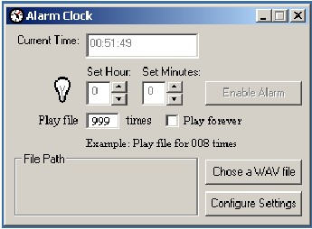



## Alarm clock that lets you chose your own MP3/WAV file

### Description

Alarm clock that lets you give out a personal message on alarm

and lets you chose your own MP3/WAV file to play. Cool and easy!

Try it out and vote for it! Thanks!
 
### More Info
 
Click and Clacks

just click it up, mate!

BEEP BEEP!

It's gonna wake u up no matter what!

             |
---                |---
**Submitted On**   |2001-01-09 06:03:30
**By**             |[Syed Fahad Gilani](https://github.com/Planet-Source-Code/PSCIndex/blob/master/ByAuthor/syed-fahad-gilani.md)
**Level**          |Intermediate
**User Rating**    |4.4 (22 globes from 5 users)
**Compatibility**  |VB 4\.0 \(32\-bit\), VB 5\.0, VB 6\.0
**Category**       |[Complete Applications](https://github.com/Planet-Source-Code/PSCIndex/blob/master/ByCategory/complete-applications__1-27.md)
**World**          |[Visual Basic](https://github.com/Planet-Source-Code/PSCIndex/blob/master/ByWorld/visual-basic.md)
**Archive File**   |[CODE\_UPLOAD13561182001\.zip](https://github.com/Planet-Source-Code/syed-fahad-gilani-alarm-clock-that-lets-you-chose-your-own-mp3-wav-file__1-14265/archive/master.zip)

